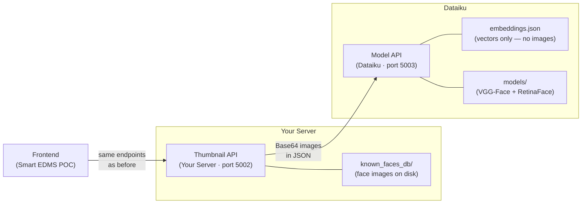
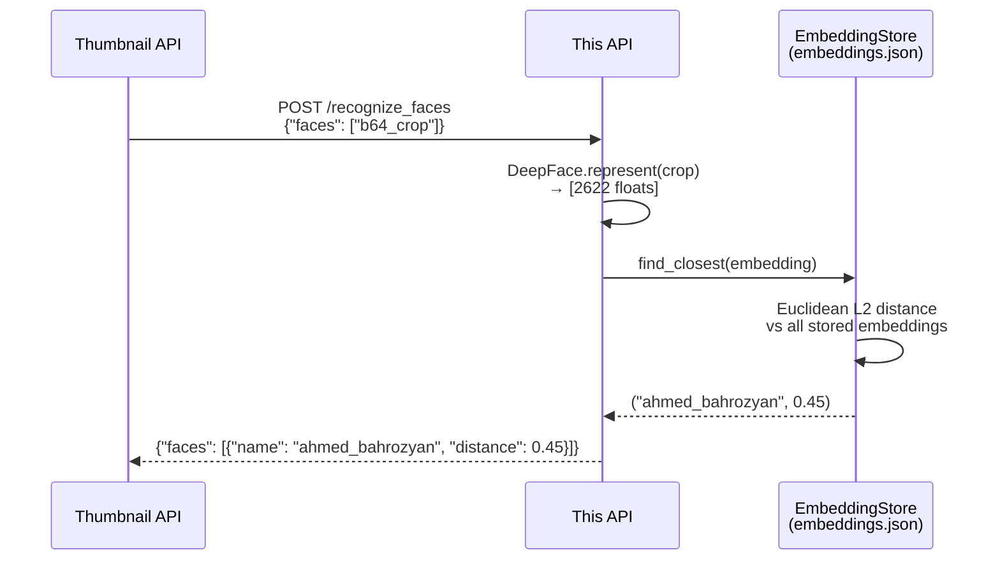
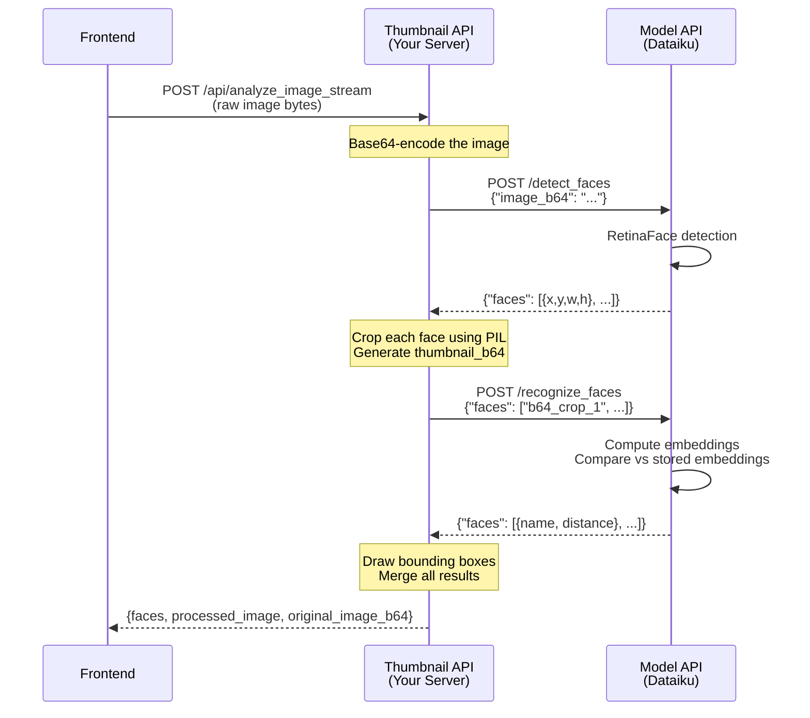
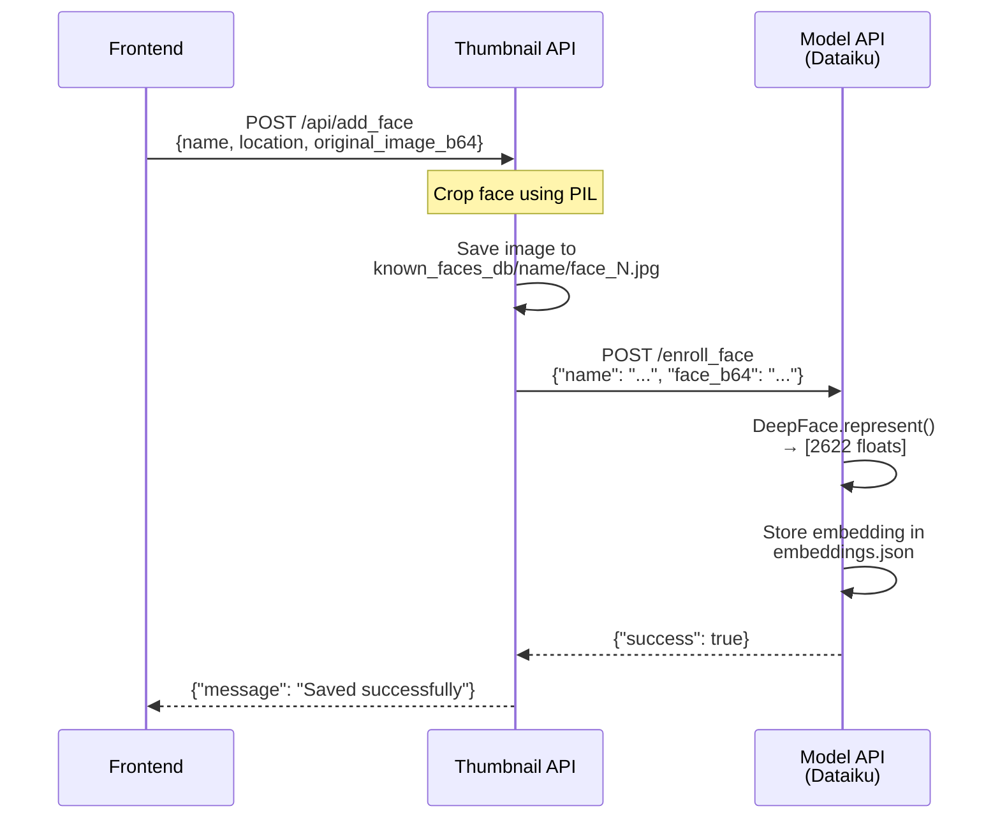

# Dataiku Model API — Architecture

This API hosts the DeepFace ML models for face detection and recognition.
It stores **only embedding vectors** (arrays of floats) — never actual face images.

---

## System Overview



---

## What This API Does

| Responsibility | Details |
|---------------|---------|
| **Face Detection** | Uses RetinaFace to locate faces in images — returns coordinates only |
| **Face Recognition** | Computes VGG-Face embeddings and compares against stored embeddings |
| **Embedding Storage** | Maintains `embeddings.json` — a lightweight JSON file of float vectors |
| **Model Hosting** | Loads VGG-Face and RetinaFace models from the `models/` directory |

## What This API Does NOT Do

| Responsibility | Handled By |
|---------------|-----------|
| Store face images | Thumbnail API |
| Generate thumbnails | Thumbnail API |
| Draw bounding boxes | Thumbnail API |
| Serve frontend endpoints | Thumbnail API |

---

## Endpoints

### `POST /detect_faces`
Detects face locations in a Base64-encoded image.

```
Request:  { "image_b64": "<base64 string>" }
Response: { "faces": [
    { "index": 1, "x": 100, "y": 50, "w": 80, "h": 100, "confidence": 0.99 }
]}
```

### `POST /recognize_faces`
Recognizes pre-cropped face thumbnails against stored embeddings.

```
Request:  { "faces": ["<b64_crop_1>", "<b64_crop_2>"] }
Response: { "faces": [
    { "index": 1, "name": "ahmed_bahrozyan", "distance": 0.45 },
    { "index": 2, "name": "Unknown", "distance": null }
]}
```

### `POST /enroll_face`
Computes an embedding for a face crop and stores it. **No image is saved.**

```
Request:  { "name": "Ahmed Bahrozyan", "face_b64": "<base64 crop>" }
Response: { "success": true, "message": "Embedding stored for 'ahmed_bahrozyan'." }
```

### `POST /delete_face`
Removes all embeddings for a person.

```
Request:  { "name": "ahmed_bahrozyan" }
Response: { "success": true, "message": "Removed all embeddings for 'ahmed_bahrozyan'." }
```

### `GET /list_faces`
Lists all enrolled people and how many embeddings each has.

```
Response: { "faces": { "ahmed_bahrozyan": 2, "mattar_al_tayer": 1 } }
```

### `GET /health`
Health-check / readiness probe.

```
Response: { "status": "ok", "enrolled_people": 15, "total_embeddings": 23 }
```

---

## How Recognition Works (Embeddings-Only)

Traditional DeepFace recognition requires a directory of face images on disk.
This API replaces that with a pure-embeddings approach:



**Key facts about embeddings:**
- VGG-Face produces a **2,622-dimension float vector** per face
- Each embedding is ~21 KB (vs 50-200 KB for a face image)
- Distance comparison is pure NumPy math — microseconds per comparison
- The threshold for a match is **≤ 0.9** (euclidean L2), same as the original system

---

## Data Flow: Analyze Image (Full Pipeline)



## Data Flow: Enroll a Face



---

## File Structure

```
Dataiku Model API/
├── dataiku_model_api.py    # Flask API — all endpoints
├── embedding_store.py      # Thread-safe embedding persistence
├── embeddings.json         # Generated at runtime — float vectors only
├── models/                 # Model weight files (ship separately)
│   ├── vgg_face_weights.h5
│   └── retinaface.h5
├── requirements.txt
├── .gitignore
└── ARCHITECTURE.md         # This file
```

---

## Environment Variables

| Variable | Default | Description |
|----------|---------|-------------|
| `HTTP_PLATFORM_PORT` | `5003` | Port to serve on |
| `EMBEDDINGS_FILE` | `./embeddings.json` | Path to the embeddings JSON file |
| `DEEPFACE_HOME` | (system default) | Where DeepFace caches model weights |

---

## Initial Setup

1. Copy `models/vgg_face_weights.h5` and `models/retinaface.h5` into the `models/` directory.
2. Install dependencies: `pip install -r requirements.txt`
3. Start the API: `python dataiku_model_api.py`
4. Run the migration script (from the Thumbnail API project) to seed embeddings from existing `known_faces_db/`:
   ```
   python migrate_embeddings.py
   ```
